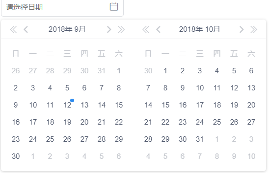

## 用法
1. 页面上引入datepicker.js和datepicker.css
2. 
```js
var datePicker = document.getElementsByClassName('date-picker')[0]
var body = document.body
new DatePicker(body, datePicker, true, 0, function (inputVal) {
    console.log(inputVal)
})
```

## 参数说明
- body body对象
- datePicker 日历插件父元素，class要加上`date-picker`
- true/false 代表开启日期范围/单个日期选择
- 0 自定义，Number类型。用于日期插件**id**编号，避免页面上同时引入多个日历插件冲突
- function 回调函数，inputVal，选中的日期，数组

## 开发插件背景说明
1. 样式全部来自 **iview**，代码参考组内datepicker和iview
2. 组内用到的日期选择插件依赖于jq，可以预见接下来技术可能过渡到vue，未来也许会有react。那时候该插件就不适用了，如果在vue里面还引入jq，反而得不偿失。所以我打算用 **js**来重写。
3. 原来插件采用的es6 class语法，我将延续这中写法。原来插件样式采用sass语法，不够通用，我还是继续采取普通css写法
4. 写日期选择插件的那位兄弟离职了，不然可以和他讨教下。但是，我还是偏向于iview的样式风格，原先的插件风格感觉体验不好。那位兄弟估计是照着 elementui 样式风格去写的。我的布局风格更偏向于iview吧
5. **兼容性 >= IE10；（用到了classList）**

## 开发经历
- create at 2018-08-20
- start at 2018-08-27
- 单个日期选择切换等功能 complete at 2018-08-30
- 日期范围选择切换等功能 complete at 忘了
- 日期范围点击选中日期并改变样式以及切换年月点击选中日期等功能 complete at 2018-09-11 PS:懒得一笔
- 最终完成(样式优化等) complete at 不知道

## bug记录
1. 快速点击时出现 undefined
    一开始想加防抖，后来发现是 e.target 为sapn时出现的问题

2. 也是快速点击切换年月时发现有三个日期被选中，但是难以复现

3. 测试时发现有时候控制台会报 Cannot read property 'innerHTML' of undefined
    定位发现，当点击 日~六 等span时会出现这种情况，考虑不周，点击这里应该不执行任何东西